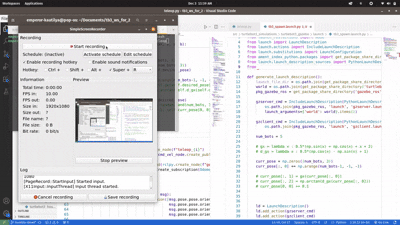

= Robot-Conga
A multi-agent simulation framework
:toc:
:toc-title: 📑 Table of Contents
:toc-placement!:
:toclevels: 3

**The Robot-Conga** is a leader–follower walking approach for sequential path following in a multi-agent system.

Project Website: https://robot-conga.github.io/[Robot-Conga Website]

---

== 🎥 Demo

Here are some examples of Robot-Conga in action:

---

== 🔎 Overview

The *Robot-Conga* project demonstrates coordinated leader–follower locomotion in a multi-agent system.  
It leverages *ROS* and *Gazebo* for real-time robotics simulation and can be adapted for quadrupeds or wheeled robots.  

This project can be extended for:
- Swarm robotics research
- Reinforcement learning
- Path-following experiments
- Multi-agent system coordination

---

== 🛠️ Technologies Used

- *Python* – Primary programming language
- *ROS (Robot Operating System)* – Middleware for robot control
- *Gazebo* – Physics-based robotics simulator
- *PyBullet* – Alternative physics engine (legacy implementation)
- *NumPy / Matplotlib* – Numerical computation and visualization

---

== 🚀 Getting Started

Follow these steps to set up the project locally:

. Clone the repository
+
[source,bash]
----
git clone https://github.com/Tiwari-Pranav/Robot-conga-turtlebot3-ros-gazebo/
cd Robot-conga-turtlebot3-ros-gazebo
----

. Install dependencies  
Make sure you have **ROS Humble** (or compatible version) and **Gazebo** installed.  
If using `rosdep`:
+
[source,bash]
----
rosdep install --from-paths src --ignore-src -r -y
----

. Build the workspace
+
[source,bash]
----
catkin_make
source devel/setup.bash
----

. Launch a simulation
+
[source,bash]
----
roslaunch robot_conga leader_follower.launch
----

== 🤝 Contributing

Contributions, issues, and feature requests are welcome!  
Feel free to open an https://github.com/Tiwari-Pranav/Robot-conga-turtlebot3-ros-gazebo/issues[issue] or submit a pull request.
